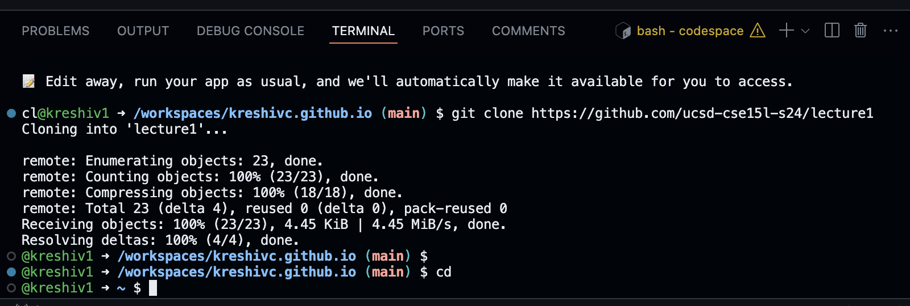
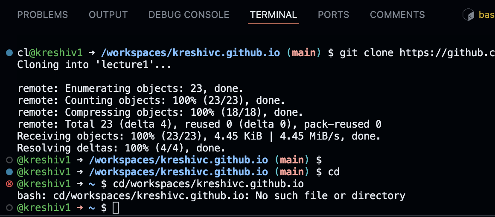
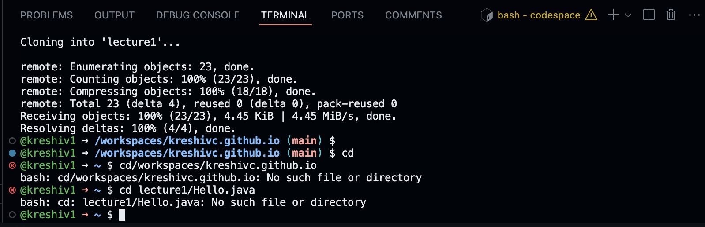
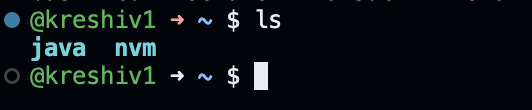
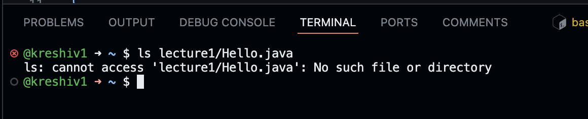
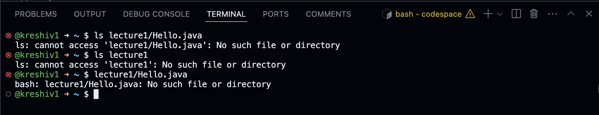
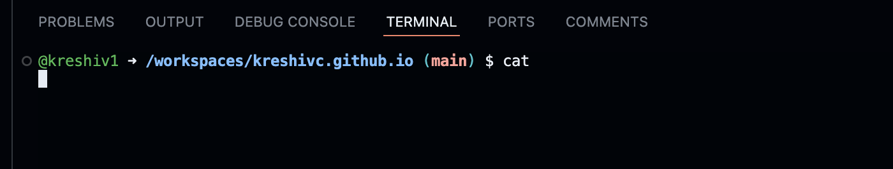
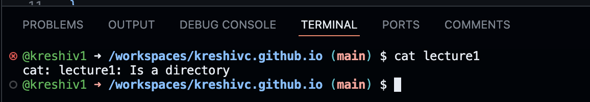
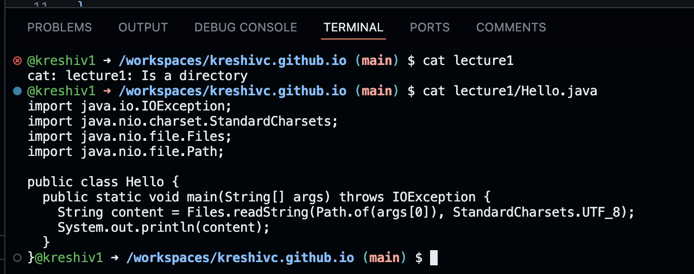

/workspaces/kreshivc.github.io
directorty not specified so command didnt change
no error

~
no error
changed directory to lecture1

/workspaces/kreshivc.github.io
did not change directory
no error

/workspaces/kreshivc.github.io
made list
no error

/workspaces/kreshivc.github.io
list of files in lecture 1
no error

just gave name of file
no erorr

/workspaces/kreshivc.github.io

no output
no error
/workspaces/kreshivc.github.io

/workspaces/kreshivc.github.io
error was given

/workspaces/kreshivc.github.io
lists contents of hello.java
no error

